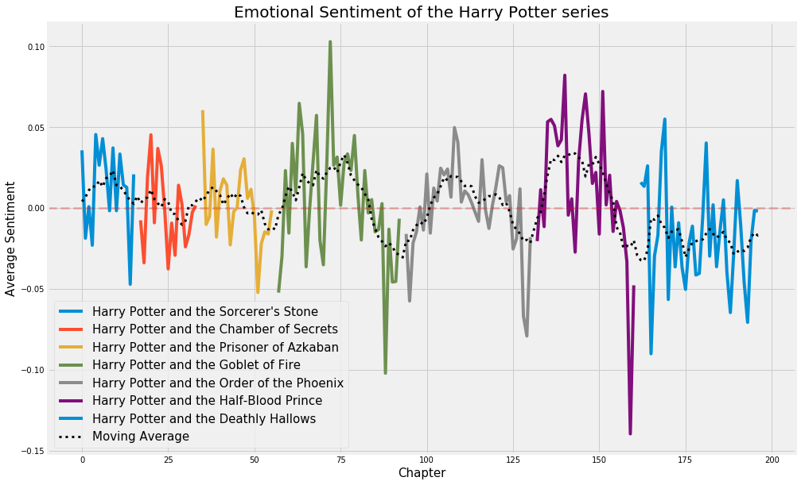

# NLP on the Books of Harry Potter

This repo demonstrates a collection of NLP tasks all using the books of Harry Potter for source documents. Individual tasks can be read about here:

1. [Topic modeling with Latent Dirichlet Allocation](https://towardsdatascience.com/basic-nlp-on-the-texts-of-harry-potter-topic-modeling-with-latent-dirichlet-allocation-f3c00f77b0f5)
2. [Regular Expression case study](https://towardsdatascience.com/regex-on-the-texts-of-harry-potter-96b8a3878303)
3. [Extractive text summarization](https://towardsdatascience.com/text-summarization-on-the-books-of-harry-potter-5e9f5bf8ca6c)
4. [Sentiment analysis](https://towardsdatascience.com/basic-nlp-on-the-texts-of-harry-potter-sentiment-analysis-1b474b13651d)



## Instructions for BasicNLP class (basic_nlp.py)
Functions of the class are topic modeling with LDA, document summarization, and sentiment analysis.

1. Initialize the class with a list of documents and an optional list of document titles, for example:
```
texts = ['this is the first document', 'this is the second document', 'this is the third document']
titles = ['doc1', 'doc2', 'doc3']

nlp = BasicNLP(texts, titles)
```

2. LDA:

    1. Create an elbow plot and print the coherence scores by specifying the number of topics to include, with:
        ```
        nlp.compute_coherence(start=5, stop=20, step=3)
        ```
    2. Set the number of topics to use in the model with:
        ```
        nlp.set_number_of_topics(10)
        ```
    3. View the clusters (only available in Jupyter notebook):
        ```
        import pyLDAvis
        pyLDAvis.enable_notebook()
        vis = nlp.view_clusters()
        pyLDAvis.display(vis)
        ```
    4. Get the vocabulary for each topic in the LDA model with (topics can be 'all', a list of integers, or a single integer):
        ```
        nlp.get_topic_vocabulary(topics='all', num_words=10)
        ```
    5. Get the documents most highly associated with the given topics with:
        ```
        nlp.get_representative_documents(topics='all', num_docs=1)
        ```
    6. Get the sentence summaries of the documents most highly associated with the given topics with:
        ```
        nlp.get_representative_sentences(topics='all', num_sentences=3)
        ```
    7.  Provide a name for an LDA topic (if preferred over the numbering system) with:
        ```
        nlp.name_topic(topic_number=1, topic_name='My topic')
        ```
3. Document summarization:

    Get the sentence summaries of the requested documents with:
    ```
    nlp.get_document_summaries(documents='all', num_sent=5)
    ```
4. Sentiment analysis:

    Get the sentiment scores (compound, positive, neutral, negative) for the requested documents with:
    ```
    nlp.get_sentiment(documents='all')
    ```